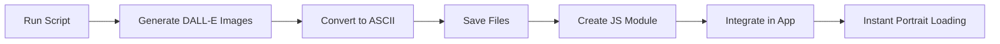

# D&D Character Portrait Automation System

## What Is This?

An **automated system** that generates AI-powered character portraits for all race and class combinations in your D&D app, eliminating the manual back-and-forth workflow.

## The Problem It Solves

**Before:** 😫
1. User creates a character
2. You manually generate a DALL-E image
3. You manually convert to ASCII art
4. User waits for each step
5. Repeat 117 times for all combinations

**After:** 🎉
1. Run one script
2. Wait ~35 minutes (unattended)
3. Get all 117 portraits ready to use
4. Instant loading in your app

## What Gets Generated

### Portraits
- **9 race-only portraits** (for initial character creation)
- **108 race+class portraits** (for complete characters)
- **Total: 117 unique portraits**

### Output Formats
- ✅ High-quality PNG images (1024×1024)
- ✅ ASCII art (160×80 characters with Floyd-Steinberg dithering)
- ✅ JavaScript module for easy integration
- ✅ Manifest with metadata and statistics

## Quick Start

```bash
# 1. Setup
cd scripts
pip install -r requirements.txt
export OPENAI_API_KEY='sk-your-key-here'

# 2. Generate (test sample first)
python generate_sample.py --create-js

# 3. Generate all portraits
python generate_all_portraits.py --create-js

# 4. Integrate
# See scripts/INTEGRATION_GUIDE.md
```

## Cost & Time

| What | Sample (9) | Full (117) |
|------|-----------|-----------|
| **Cost** | ~$0.40 | ~$4.70 |
| **Time** | ~3 min | ~35 min |
| **Portraits** | 3 races + 6 combos | 9 races + 108 combos |

## Directory Structure

```
scripts/
├── generate_all_portraits.py   # Main generator
├── generate_sample.py          # Quick test
├── generate.sh                 # Run script
├── QUICKSTART.md               # Start here!
├── README.md                   # Full docs
└── INTEGRATION_GUIDE.md        # How to use

generated_portraits/
├── images/                     # PNG files
│   ├── elf.png
│   ├── elf-wizard.png
│   └── ...
├── ascii/                      # ASCII text files
│   ├── elf.txt
│   ├── elf-wizard.txt
│   └── ...
├── manifest.json               # Metadata
└── portraits.js                # Ready to import
```

## Integration Options

### Option 1: JavaScript Module (Recommended)
```javascript
import { getPortrait } from './portraits.js';
const portrait = getPortrait('elf', 'wizard');
```

### Option 2: Dynamic Loading
```javascript
const response = await fetch('/generated_portraits/ascii/elf-wizard.txt');
const portrait = await response.text();
```

### Option 3: Preload Cache
```javascript
await PortraitLoader.loadAll();
const portrait = PortraitLoader.get('elf', 'wizard');
```

See `scripts/INTEGRATION_GUIDE.md` for complete examples.

## Features

✅ **Fully Automated** - One command, wait, done  
✅ **High Quality** - DALL-E 3 with custom prompts  
✅ **Smart Dithering** - Floyd-Steinberg algorithm  
✅ **Resume Support** - Skips existing portraits  
✅ **Retry Logic** - Auto-retry failed generations  
✅ **Rate Limiting** - Respects API limits  
✅ **Progress Tracking** - Detailed console output  
✅ **Manifest File** - JSON metadata for all portraits  
✅ **Ready to Use** - JavaScript module included  

## Customization

### Change ASCII Size
Edit in `generate_all_portraits.py`:
```python
ASCII_WIDTH = 160   # Your width
ASCII_HEIGHT = 80   # Your height
```

### Change Art Style
Edit `build_prompt()` method:
```python
parts.append("anime style character portrait")
parts.append("pixel art retro 16-bit style")
parts.append("photorealistic detailed portrait")
```

### Generate Specific Combinations
Edit the lists:
```python
RACES = ["Elf", "Dwarf"]  # Only these races
CLASSES = ["Wizard"]       # Only this class
```

## Benefits

### For Development
- 🚀 **No more manual work** - Automate everything
- 🔄 **Easy regeneration** - Rerun anytime
- 🎨 **Consistent style** - Same prompt system
- 📊 **Track progress** - Built-in statistics

### For Users
- ⚡ **Instant loading** - Pre-generated portraits
- 💰 **No API costs** - Generate once, use forever
- 📴 **Offline support** - No internet needed
- ✨ **Better UX** - Smooth character creation

## Documentation

- 📖 **Start here:** `scripts/QUICKSTART.md`
- 📚 **Full details:** `scripts/README.md`
- 🔌 **Integration:** `scripts/INTEGRATION_GUIDE.md`

## Example Output

After running, you'll have portraits like:

```
generated_portraits/ascii/elf-wizard.txt:

        ___
       /   \
      |  ^  |
     /|  |  |\
    | |  |  | |
    | |  |  | |
     \|  |  |/
      |_____|
        |||
       [★★★]
     [ARCANE]
```

(Actual portraits are 160×80 characters with detailed ASCII art)

## Workflow



## Support

Need help?
1. Check `scripts/QUICKSTART.md` - Quick start guide
2. Check `scripts/README.md` - Full documentation  
3. Check `scripts/INTEGRATION_GUIDE.md` - Integration help

## Summary

This automation system transforms the tedious manual process of generating character portraits into a simple one-command operation. Generate once, use forever, and give your users instant, beautiful character portraits without any manual intervention.

**Total time saved:** Hours of manual work → One command  
**Cost:** ~$5 one-time  
**Result:** 117 production-ready character portraits  

🎲 Happy adventuring! ✨


