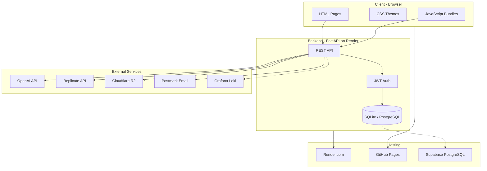

# DandDy Tech Stack

A complete reference for all technologies, services, and architecture decisions in the DandDy D&D 5e character builder and manager.

## Architecture Overview



---

## Frontend

| Aspect | Technology |
|--------|------------|
| **Language** | Vanilla JavaScript (ES6+) |
| **Framework** | None (intentionally framework-free) |
| **Styling** | Custom CSS with terminal/retro aesthetic |
| **Theming** | CSS custom properties (variables) |
| **Font** | Google Sans Code via [@fontsource CDN](https://cdn.jsdelivr.net/npm/@fontsource/google-sans-code) |
| **Build Tool** | Custom Python bundler (`scripts/simple_bundle.py`) |
| **Minification** | rjsmin |
| **Dev Server** | Python `http.server` on port 8080 |

### Entry Points

| Page | Path | Bundle |
|------|------|--------|
| Character Manager | `index.html` | `manager.bundle.js` |
| Character Builder | `character-builder/index.html` | `character-builder/builder.bundle.js` |

### Key Frontend Files

```
danddy-config.js          # Global config, API URLs, storage keys
danddy-auth.js            # Authentication state & token management
danddy-storage.js         # LocalStorage abstraction
character-manager.js      # Main manager UI logic
character-storage.js      # Character CRUD operations
portraits-ui.js           # Portrait selection & generation UI
shared-character-sheet.js # Shared character sheet rendering
terminal-theme.css        # Core terminal aesthetic styles
portraits.css             # Portrait display styles
character-manager.css     # Manager-specific styles
```

### Build Process

```bash
# Bundle all JS files (with minification)
python scripts/simple_bundle.py

# Bundle without minification (for debugging)
python scripts/simple_bundle.py --no-minify
```

---

## Backend

| Aspect | Technology |
|--------|------------|
| **Framework** | FastAPI |
| **Language** | Python 3.11+ |
| **ASGI Server** | Uvicorn |
| **ORM** | SQLAlchemy 2.0 |
| **Validation** | Pydantic v2 with pydantic-settings |
| **Auth** | JWT via python-jose |
| **Password Hashing** | passlib + bcrypt |
| **HTTP Client** | httpx (async) |
| **Compression** | GZip middleware (responses > 1KB) |

### API Routes

| Router | Prefix | Purpose |
|--------|--------|---------|
| `auth` | `/api` | Login, register, password reset |
| `characters` | `/api` | Character CRUD |
| `campaigns` | `/api` | Campaign management |
| `users` | `/api` | User profile operations |
| `ai` | `/api/ai` | AI-powered features |
| `prompt_entries` | `/api` | Portrait style prompts |
| `shares` | `/api` | Character sharing |

### Key Backend Files

```
backend/
├── main.py                    # FastAPI app, middleware, routers
├── database/
│   └── database.py            # SQLAlchemy engine, settings, migrations
├── models/
│   ├── user.py                # User model with roles
│   ├── character.py           # Character model
│   ├── campaign.py            # Campaign model
│   ├── character_share.py     # Sharing model
│   └── prompt_entry.py        # Portrait prompt styles
├── routes/
│   ├── auth.py                # Authentication endpoints
│   ├── characters.py          # Character endpoints
│   ├── campaigns.py           # Campaign endpoints
│   ├── ai.py                  # AI service endpoints
│   ├── users.py               # User endpoints
│   ├── prompt_entries.py      # Prompt management
│   └── shares.py              # Sharing endpoints
├── schemas/                   # Pydantic request/response schemas
├── utils/
│   ├── auth.py                # JWT utilities, password hashing
│   └── email.py               # Postmark email sending
└── requirements.txt           # Python dependencies
```

### Dependencies (requirements.txt)

```
fastapi==0.115.0
uvicorn[standard]==0.32.0
sqlalchemy==2.0.36
psycopg[binary]>=3.1.0
python-jose[cryptography]==3.3.0
passlib[bcrypt]==1.7.4
bcrypt==4.2.1
python-multipart==0.0.12
pydantic==2.10.3
pydantic-settings==2.6.1
python-dotenv==1.0.1
alembic==1.14.0
openai==1.54.3
httpx==0.27.2
email-validator==2.2.0
boto3==1.35.90
replicate==1.0.4
```

---

## Database

| Environment | Database | Connection |
|-------------|----------|------------|
| **Development** | SQLite | `sqlite:///./danddy.db` |
| **Production** | PostgreSQL | Supabase via `DATABASE_URL` |

### Driver

- PostgreSQL connections use **psycopg v3** (not psycopg2) for better Supabase connection pooler compatibility
- URL transformation: `postgresql://` → `postgresql+psycopg://`

### Migrations

Lightweight inline migrations in `database.py` using raw SQL:
- `ensure_timestamp_columns()` - Adds created_at/updated_at to characters
- `ensure_prompt_entry_columns()` - Adds background_description, is_global, is_archived
- `ensure_sex_column()` - Adds sex column to characters
- `ensure_ai_image_usage_table()` - Creates AI image quota tracking
- `ensure_ai_character_creation_usage_table()` - Creates character creation quota tracking

### Data Models

| Model | Table | Purpose |
|-------|-------|---------|
| `User` | `users` | User accounts with roles (user/admin) |
| `Character` | `characters` | D&D character data (JSON blob + metadata) |
| `Campaign` | `campaigns` | Campaign groupings |
| `CharacterShare` | `character_shares` | Public sharing tokens |
| `PromptEntry` | `prompt_entries` | Portrait style definitions |

---

## AI Services

### OpenAI Integration

| Feature | Model | Endpoint |
|---------|-------|----------|
| Chat completion | `gpt-3.5-turbo` | `/api/ai/chat/completion` |
| Narrator comments | `gpt-3.5-turbo` | `/api/ai/narrator/comment` |
| Character names | `gpt-3.5-turbo` | `/api/ai/characters/names` |
| Backstory generation | `gpt-3.5-turbo` | `/api/ai/characters/backstory` |
| Combined summary | `gpt-3.5-turbo` | `/api/ai/characters/summary` |
| Image generation | `dall-e-3`, `gpt-image-1` | `/api/ai/images/generate` |

### Replicate Integration

| Model | Purpose |
|-------|---------|
| `flux-1.1-pro` | High-quality portrait generation |
| `flux-schnell` | Fast, cost-effective portraits |

### Rate Limiting & Quotas

| Limit Type | Default | Scope |
|------------|---------|-------|
| Requests/minute | 10 | Per user/IP |
| Requests/day | 100 | Per user/IP |
| Images/day | 10 | Per user/IP |
| Character creations/day | 5 | Per user/IP |
| Character summary cooldown | 20 seconds | Per user/IP |

Admins and development mode bypass all rate limits.

---

## Cloud Infrastructure

### Cloudflare R2 (Portrait Storage)

- **Purpose**: Persistent storage for AI-generated portraits
- **Protocol**: S3-compatible API via boto3
- **Access**: Public read via custom domain or R2 dev URL

Environment variables:
```
R2_ACCOUNT_ID
R2_ACCESS_KEY_ID
R2_SECRET_ACCESS_KEY
R2_BUCKET_NAME
R2_PUBLIC_BASE_URL
```

### Postmark (Email)

- **Purpose**: Transactional emails (password reset)
- **Integration**: REST API via httpx

Environment variables:
```
POSTMARK_SERVER_TOKEN
EMAIL_FROM
EMAIL_REPLY_TO (optional)
FRONTEND_RESET_BASE
```

### Grafana Loki (Observability)

- **Purpose**: Centralized logging for OpenAI rate limits and usage
- **Optional**: App functions without it

Environment variables:
```
GRAFANA_LOKI_URL
GRAFANA_LOKI_TOKEN
```

---

## Deployment

### Backend (Render.com)

Configuration via `render.yaml`:

```yaml
services:
  - type: web
    name: danddy-api
    runtime: python
    rootDir: backend
    buildCommand: pip install -r requirements.txt
    startCommand: uvicorn main:app --host 0.0.0.0 --port $PORT
```

Key environment variables:
- `DATABASE_URL` - Supabase PostgreSQL connection string
- `SECRET_KEY` - JWT signing key (auto-generated)
- `OPENAI_API_KEY` - OpenAI API access
- `PRODUCTION=true` - Enables production CORS and rate limiting
- `ALLOWED_ORIGINS` - Comma-separated allowed frontend origins

### Frontend (GitHub Pages)

- **Repository**: Served as static files
- **Domain**: `danddy.app` (custom domain via CNAME)
- **Alternate**: `khoi-stripe.github.io`

### CORS Configuration

**Production** (`PRODUCTION=true`):
- Configured origins from `ALLOWED_ORIGINS`
- Always includes `localhost:8080` for testing

**Development** (default):
- `http://localhost:8080`
- `http://127.0.0.1:8080`

---

## Local Development

### Port Allocation

| Service | Port | URL |
|---------|------|-----|
| Backend API | 8000 | `http://localhost:8000` |
| Frontend | 8080 | `http://localhost:8080` |

### Quick Start

```bash
# Start everything
./start-dev.sh

# Or separately:
./start-backend.sh   # Terminal 1
./start-frontend.sh  # Terminal 2
```

### First-Time Setup

```bash
cd backend
python3 -m venv venv
source venv/bin/activate
pip install -r requirements.txt
cd ..
```

### Environment Variables (.env)

Create `backend/.env`:

```bash
# Required for AI features
OPENAI_API_KEY=sk-...

# Optional: Replicate for Flux models
REPLICATE_API_TOKEN=r8_...

# Optional: Cloudflare R2
R2_ACCOUNT_ID=...
R2_ACCESS_KEY_ID=...
R2_SECRET_ACCESS_KEY=...
R2_BUCKET_NAME=...
R2_PUBLIC_BASE_URL=...

# Optional: Email (Postmark)
POSTMARK_SERVER_TOKEN=...
EMAIL_FROM=no-reply@example.com

# Optional: Observability
GRAFANA_LOKI_URL=...
GRAFANA_LOKI_TOKEN=...
```

### Useful URLs

| Resource | URL |
|----------|-----|
| Character Manager | http://localhost:8080/index.html |
| Character Builder | http://localhost:8080/character-builder/index.html |
| API Documentation | http://localhost:8000/docs |
| API Health Check | http://localhost:8000/health |

---

## Security

### Authentication Flow

1. User registers/logs in via `/api/auth/register` or `/api/auth/login`
2. Server returns JWT access token (default: 60 min expiry)
3. Frontend stores token in localStorage (`dnd_auth_token`)
4. All authenticated requests include `Authorization: Bearer <token>`

### Password Security

- Hashing: bcrypt via passlib
- Password reset: Time-limited tokens sent via email

### API Key Protection

- All AI API keys stored server-side only
- Frontend never has direct access to OpenAI/Replicate credentials
- Backend proxies all AI requests

---

## File Structure Summary

```
DandDy/
├── index.html                 # Character Manager entry point
├── manager.bundle.js          # Bundled manager JS
├── character-manager.css      # Manager styles
├── terminal-theme.css         # Core terminal theme
├── portraits.css              # Portrait styles
├── danddy-config.js           # Shared configuration
├── danddy-auth.js             # Auth utilities
├── character-builder/
│   ├── index.html             # Builder entry point
│   ├── builder.bundle.js      # Bundled builder JS
│   └── character-builder.css  # Builder styles
├── backend/
│   ├── main.py                # FastAPI application
│   ├── requirements.txt       # Python dependencies
│   ├── database/              # Database layer
│   ├── models/                # SQLAlchemy models
│   ├── routes/                # API route handlers
│   ├── schemas/               # Pydantic schemas
│   └── utils/                 # Utilities (auth, email)
├── scripts/
│   └── simple_bundle.py       # JS bundler
├── render.yaml                # Render deployment config
├── start-dev.sh               # Dev environment launcher
├── start-backend.sh           # Backend launcher
└── start-frontend.sh          # Frontend launcher
```

---

## Related Documentation

- [QUICK_START.md](QUICK_START.md) - Getting started guide
- [DEVELOPMENT_GUIDE.md](DEVELOPMENT_GUIDE.md) - Detailed development notes
- [RATE_LIMITING.md](backend/RATE_LIMITING.md) - Rate limiting details
- [docs/](docs/) - Feature-specific documentation


